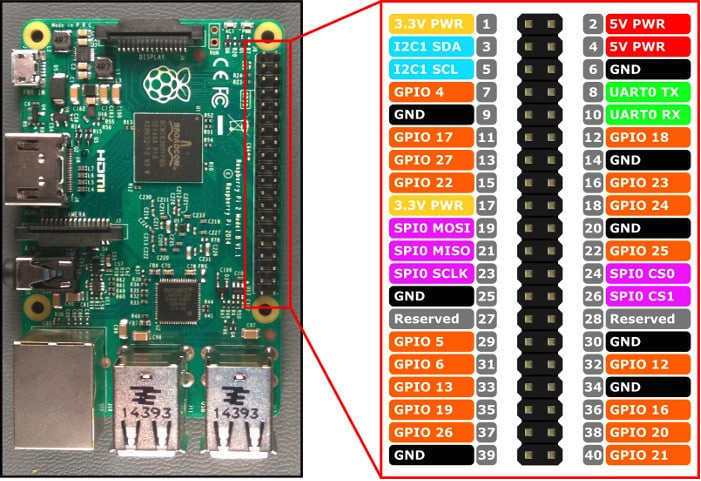

# raspi-koma

Project to handle scripts of raspberry pi with connected devices

## devices

- Raspberry pi 3 B+
- Display: OLED 0.91 inches SSD1306 I2C JK-091-12832-Y
- Switch: YwRobot ELB060677
- HC-SR04 ultrasonic range sensor

## setup

### i2c
- Enable i2c on the raspberry. `sudo raspi-config` and enable it
- Install i2c package`sudo apt-get install -y i2c-tools`
- Get the address of the i2c display `i2cdetect -y 1`

### OS packages
- Install dependencies `sudo apt-get install python3-pip python3-pil libjpeg-dev zlib1g-dev libfreetype6-dev liblcms2-dev libopenjp2-7 libtiff5-dev`

### python

- Create virtual environment `python3 -m venv raspi-koma`
- Activate it `source ./raspi-koma/bin/activate`
- Install python packages:
  - `pip3 install luma.oled`
  - `pip3 install psutil`
  - `pip3 install RPi.GPIO`
  - `pip3 install adafruit-blinka adafruit-circuitpython-ssd1306`
  - `pip3 install pyyaml`
- Or install using requirements file `pip3 install -r requirements.txt`

## scripts

- [pi_start.py](scripts/pi_start.py): Script to display information from raspberry pi to the display.
- [shutdown.py](scripts/shutdown.py): Script that handle button press to shutdown safely the raspberry pi.
- [ultrasound.py](scripts/ultrasound/ultrasound.py): Script to interact with HC-SR04.

## systemd services

Configuration files for start the scripts on boot

## GPIO

